NAMDAnalyzer
============

Python based routines for molecular dynamics simulation analysis from NAMD

Installation:
-------------

Unix and Windows
^^^^^^^^^^^^^^^^

To install it within your python distribution, use 

::

    make [build] (for openMP version) or [build_cuda] (for CUDA accelerated version - recommended) 
    make install

or

::
    
    python [setup.py, cuda_setup.py]
    python setup.py install

Start the interpreter:
----------------------

Initialization of the ipython console can be done using the following command:

:: 

    ipython -i <path to NAMDAnalyzer.py> -- <list of files to be loaded> [-s stride]

Options: 

- -s --stride 
    use to skip frames when loading a .dcd file. For instance if "-s 5" is provided, 
    only the frames that are multiples of 5 will be loaded.

Usage:
------

The program is organized on a master class contained in NAMDAnalyzer.Dataset.

Open log file and plot data
^^^^^^^^^^^^^^^^^^^^^^^^^^^

To analyze log file, the following can be used:

.. code-block:: python

    import NAMDAnalyzer as nda

    data = nda.Dataset('20190326_fss_tip4p_prelax.out') #_Import log file

    #_Another log file can be append to the imported one using data.logData.appendLOG() method  

    #_To plot data series using keywords given in data.logData.etitle, removing first 500 frames of minimization
    data.logData.plotDataSeries('TEMP KINETIC TOTAL', begin=501)

    #_To plot data distribution
    data.logData.plotDataDistribution('KINETIC', binSize=20)

    #_Data can be fitted with any model using 
    data.logData.plotDataDistribution('KINETIC', fit=True, model=your_model_function, p0=init_parameters)

Outputs of previous code:
+++++++++++++++++++++++++

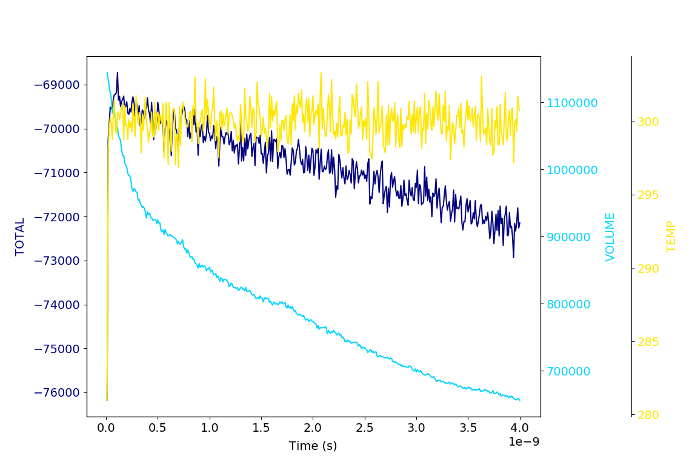

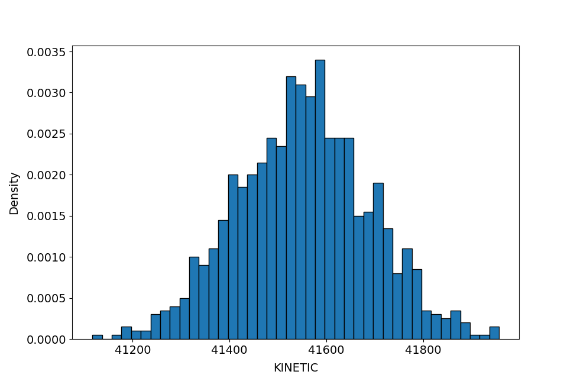

Load trajectories, selection, and analysis
^^^^^^^^^^^^^^^^^^^^^^^^^^^^^^^^^^^^^^^^^^

.. code-block:: python

    import NAMDAnalyzer as nda

    d = nda.Dataset('psfFile.psf', 'dcdFile.dcd')

    #_Trajectories can be append to already loaded ones using either d.appendDCD('dcdFile.dcd')
    #_or d.appendCoordinates('pdbFile.pdb').

    #_To compute RMSD per atom for molecules aligned in all frames
    d.getRMSDperAtom(selection='protein and segname V1', align=True, frames=slice(0, None))

    #_To compute and plot RMSD per atom for molecules aligned in all frames
    d.plotRMSDperAtom(selection='protein and segname V1', align=True, frames=slice(0, None))

    #_To compute radial pair distribution function for water within 3 angstrom of a protein region
    r, pdf = d.getRadialNumberDensity( 'name OH2 and within 3 of protein and resid 40:80',
                                       'name OH2 and within 3 of protein and resid 40:80',
                                       dr=0.1, maxR=15, frames=range(0,1000,5) )

    import matplotlib.pyplot as plt

    plt.plot(r, pdf)
    plt.xlabel('radius r [$\AA$]')
    plt.ylabel('$\\rho (r)$')
    plt.show()

    #_To plot averaged distances between a residue and the rest of the protein using a parallel plot
    d.plotAveragedDistances_parallelPlot('protein and resid 53', 'protein', maxDist=10, step=2)

    #_To plot the same distances but using a chord diagram
    cd = d.plotAveragedDistances_chordDiagram('protein and resid 53', 'protein', maxDist=10, step=2)
    cd.show()

Outputs of previous code:
+++++++++++++++++++++++++

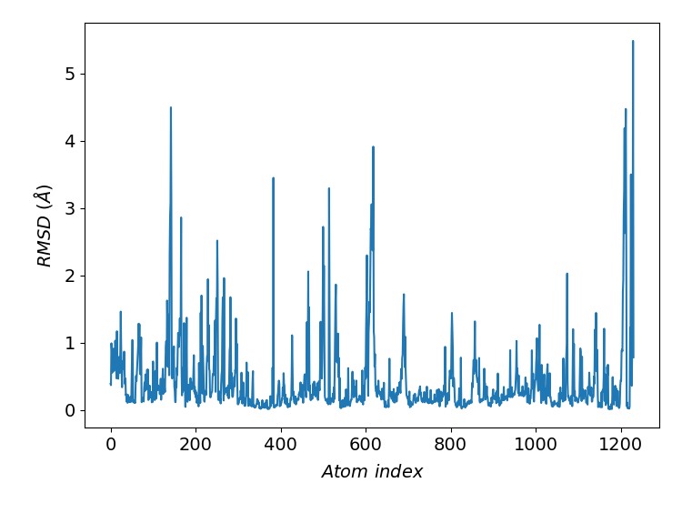
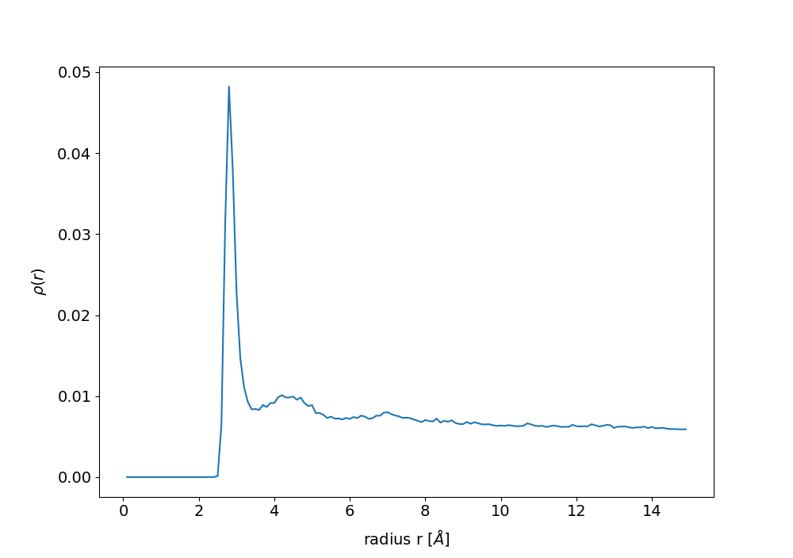
.. image:: ../fig/averagedDistances_parallel.png
   :width: 24 %
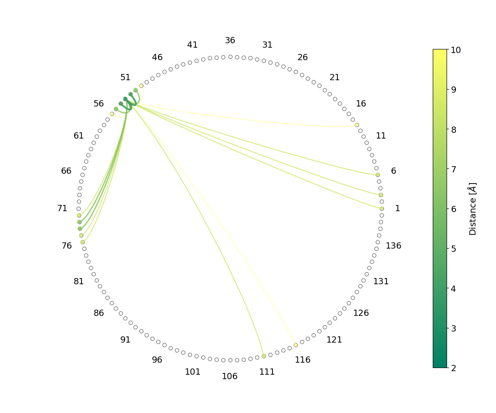

Analysis of rotations
^^^^^^^^^^^^^^^^^^^^^

.. code-block:: python

    import NAMDAnalyzer as nda
    from NAMDAnalyzer.dataAnalysis.Rotations import Rotations

    d = nda.Dataset('psfFile.psf', 'dcdFile.dcd')

    #_To analyze O-H1 water vectors for O being within 3 angstrom of protein region
    rot = Rotations(d, 'name OH2 and within 3 of protein and resid 40:80',
                       'name H1 and bound to name OH2 and within 3 of protein and resid 40:80',
                    axis='z', nbrTimeOri=20)

    rot.compRotationalRelaxation()
    rot.compOrientationalProb()

    rot.plotRotationalRelaxation()
    rot.plotOrientationalProb()

Outputs of previous code:
+++++++++++++++++++++++++

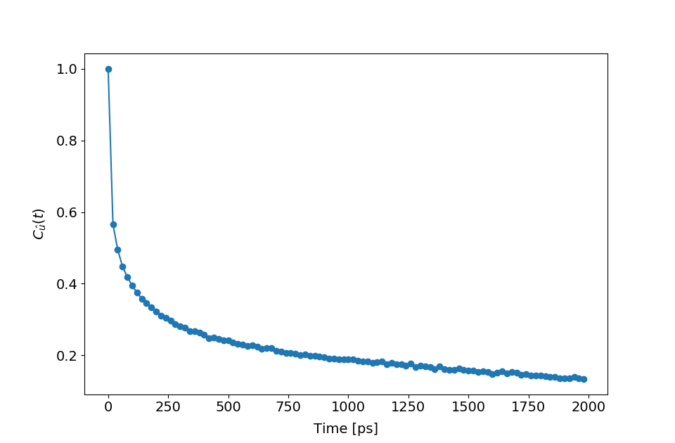
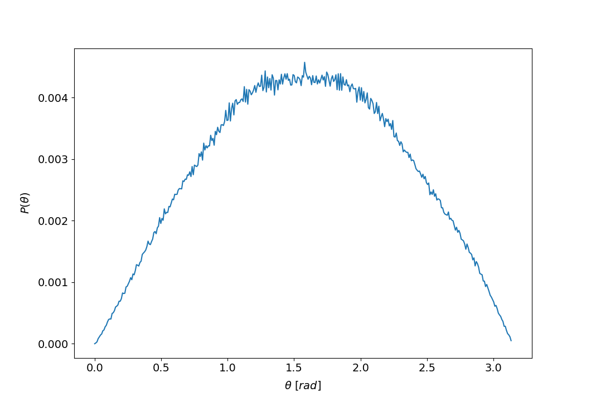

Analysis of hydrogen bonds
^^^^^^^^^^^^^^^^^^^^^^^^^^

.. code-block:: python

    import NAMDAnalyzer as nda
    from NAMDAnalyzer.dataAnalysis.HydrogenBonds import HydrogenBonds

    d = nda.Dataset('psfFile.psf', 'dcdFile.dcd')

    #_To analyze hydrogen bonds auto-correlation
    #_The 'hydrogens' argument is optional, if None, they are obtained from hydrogens bound to donors
    #_maxTime is tha maximum number of frame, maxR is the maximum distance for acceptor, hydrogen distance
    #_step is the frame increment from origin to maxTime, minAngle is the minimum angle to accept hydrogen bond
    #_between acceptor-hydrogen and donor-hydrogen vectors

    hb = HydrogenBonds(d, donors='name OH2', acceptors='name OH2', hydrogens=None, maxTime=50
                        nbrTimeOri=20, step=1, maxR=2.5, minAngle=130)

    #_For continuous auto-correlation (default if 'continuous' not given)
    hb.compAutoCorrel(continuous=1)

    #_For intermittent auto-correlation
    hb.compAutoCorrel(continuous=0)

    #_To plot the result
    hb.plotAutoCorrel(corrType='continuous')
    hb.plotAutoCorrel('intermittent')

Outputs of previous code:
+++++++++++++++++++++++++

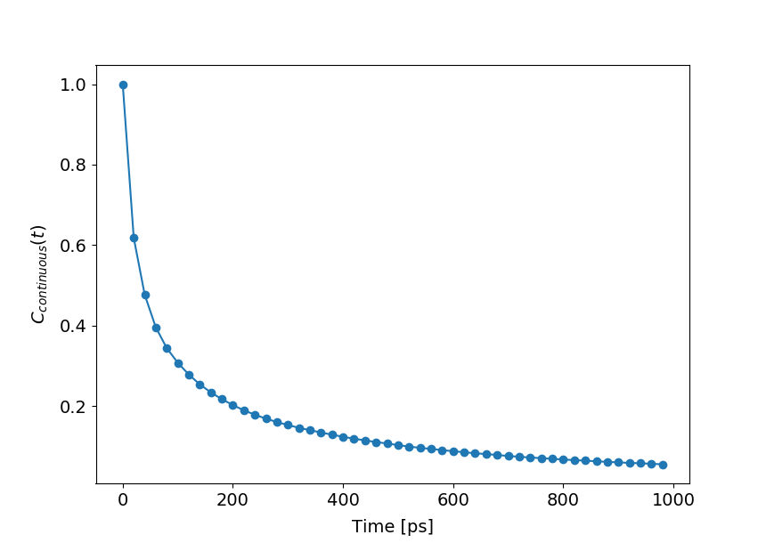
.. image:: ../fig/hbIntermittent.png
   :width: 24 %

Mean-squared displacement and neutron backscattering
^^^^^^^^^^^^^^^^^^^^^^^^^^^^^^^^^^^^^^^^^^^^^^^^^^^^

.. code-block:: python

    import NAMDAnalyzer as nda
    from NAMDAnalyzer.dataAnalysis.backscatteringDataConvert import BackScatData

    d = nda.Dataset('psfFile.psf', 'dcdFile.dcd')

    #_Defines some q-values for incoherent scattering function
    qVals = [0.2, 0.4, 0.6, 0.8, 1, 1.2, 1.4, 1.6, 1.8]

    bs = BackScatData(d)

    #_To compute MSD for non exchangeable hydrogens in protein for increasing time steps, 
    #_without center of mass motion
    msd = []

    for frame in range(0, 200, 5):
        bs.compMSD(frameNbr=frame, selection='protNonExchH', alignCOM=True)
        msd.append( bs.MSD )

    import matplotlib.pyplot as plt

    times = np.arange(0, 200, 5) * d.timestep * d.dcdFreq[0:200:5] * 1e9
    msd   = np.array(msd)

    plt.plot(times, msd[:,0])
    plt.xlabel('Time [ns]')
    plt.ylabel('MSD [$\AA^{2}$]')

    plt.show()

    #_To compute and plot incoherent intermediate function, EISF and inoherent scattering 
    #_function for water hydrogens with 200 time steps

    bs.compScatteringFunc(qVals, nbrTimeOri=50, selection='waterH', alignCOM=True, nbrTS=200)

    bs.plotIntermediateFunc()
    bs.plotEISF()
    bs.plotScatteringFunc()

Outputs of previous code:
+++++++++++++++++++++++++

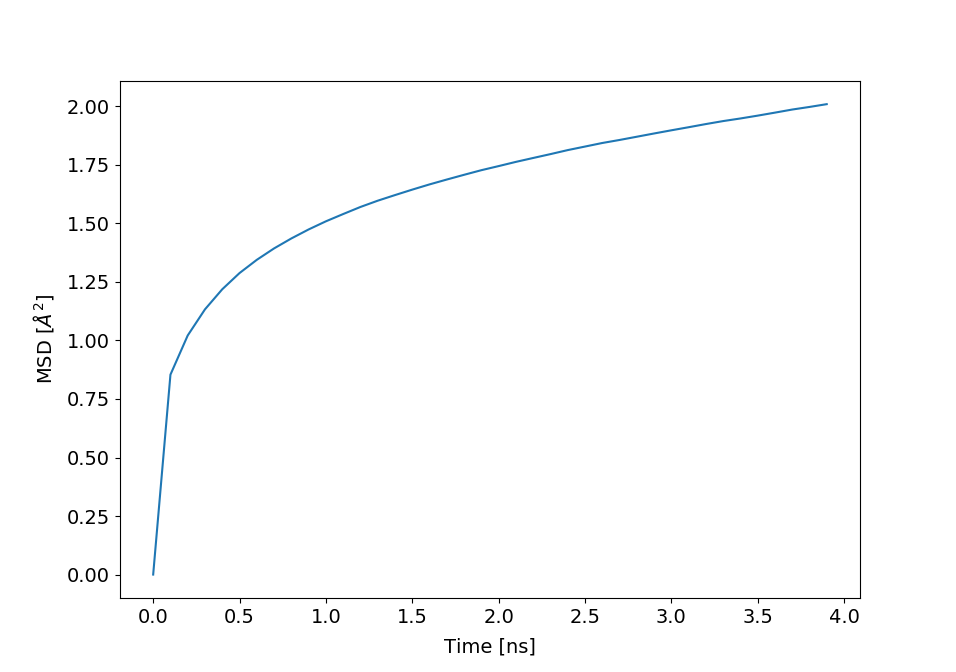
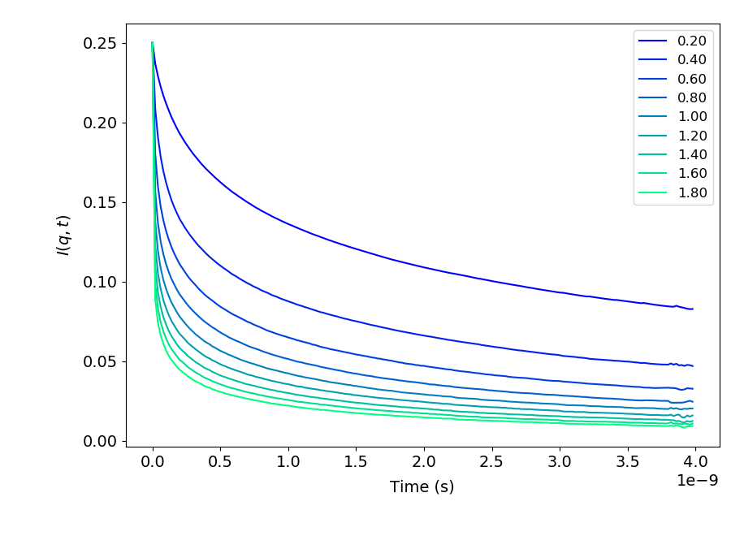
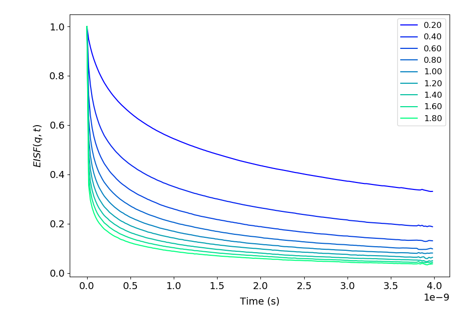
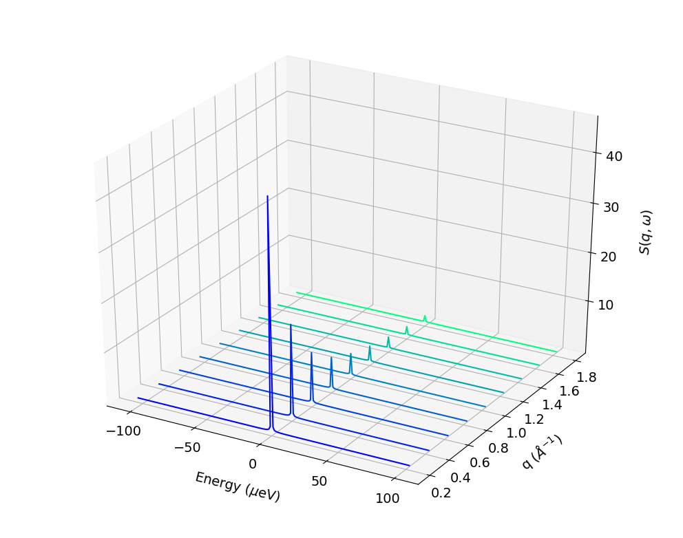

